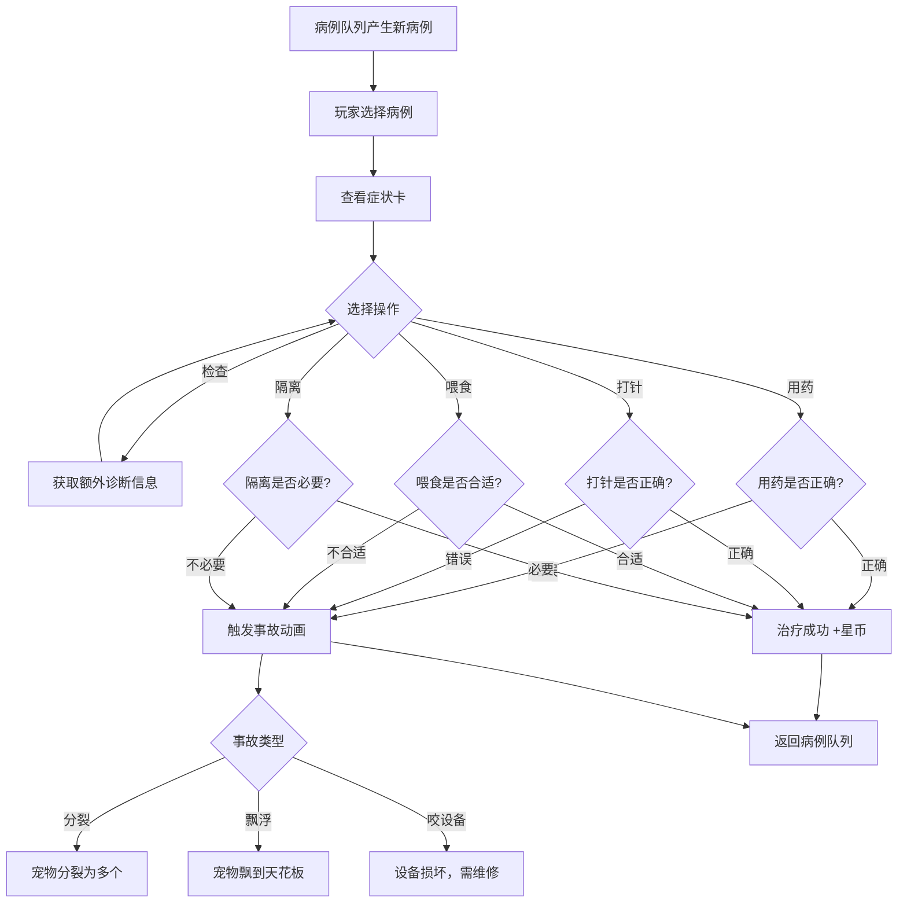

## 1. 产品概述

外星宠物诊所是一款网页模拟经营游戏，玩家扮演星际兽医，为各种奇怪的外星宠物诊断治疗。玩家需要通过观察症状卡片，选择正确的检查和治疗方案。治疗成功赚取星币，误诊则会触发荒诞的医疗事故（宠物分裂、飘到天花板、咬坏设备等），充满趣味与挑战。

- 目标用户：休闲游戏玩家、模拟经营爱好者、科幻主题爱好者
- 核心价值：通过诊断决策+意外事故的组合，创造紧张有趣的游戏体验

## 2. 核心功能

### 2.1 用户角色

| 角色 | 说明 | 核心权限 |
|------|------|----------|
| 星际兽医（玩家） | 自动进入游戏 | 诊断治疗、管理设备、积累进度 |

### 2.2 功能模块

1. **诊疗主页**：病例队列、诊疗面板、宠物展示、操作区、进度信息
2. **事故展示**：误诊时的动画演出（宠物分裂/飘浮/咬坏设备）

### 2.3 页面详情

| 页面 | 模块 | 功能描述 |
|------|------|----------|
| 诊疗主页 | 病例队列 | 左侧显示待诊宠物列表，显示宠物名称、品种、紧急度，点击选中进入诊疗 |
| 诊疗主页 | 症状卡展示 | 中上部展示当前宠物的症状卡，包含症状描述、体征数据、可能的疾病提示 |
| 诊疗主页 | 诊疗操作面板 | 中部五个操作按钮：检查、用药、打针、喂食、隔离，每个操作有冷却和消耗 |
| 诊疗主页 | 宠物展示区 | 中部可视化展示当前宠物状态（正常/治疗中/事故中） |
| 诊疗主页 | 设备状态栏 | 右侧显示诊疗设备状态（正常/损坏/维修中），设备损坏影响可用操作 |
| 诊疗主页 | 玩家进度面板 | 右侧显示星币余额、治愈数、误诊数、等级、今日收入 |
| 诊疗主页 | 事故动画层 | 全屏覆盖层，展示误诊事故动画（分裂/飘浮/咬设备），自动消退 |
| 诊疗主页 | 诊断结果弹窗 | 治疗结束后弹出诊断结果，显示正确/错误、获得星币、宠物反应 |

## 3. 核心流程

1. 病例队列中持续产生新的外星宠物病例
2. 玩家从队列中选择一个病例
3. 查看宠物的症状卡（症状描述+体征数据）
4. 根据症状判断病情，选择操作：检查（获取更多信息）、用药、打针、喂食、隔离
5. 如果治疗正确：宠物康复，玩家获得星币和经验
6. 如果误诊：触发事故动画（分裂/飘浮/咬设备），扣除星币，设备可能损坏
7. 设备损坏后需要花费星币维修，维修期间对应操作不可用
8. 随着等级提升，病例难度增加，出现更复杂的外星宠物和疾病

## 4. 用户界面设计

### 4.1 设计风格

- **主题**：太空站医疗舱 — 赛博朋克科幻风
- **主色调**：深空黑 (#0a0e1a) + 霓虹绿 (#00ff88) + 警示红 (#ff3366) + 紫外光 (#7b61ff)
- **按钮风格**：圆角矩形，霓虹发光边框，hover 时光晕增强
- **字体**：标题使用 Orbitron（科幻感），正文使用 Rajdhani（未来感但不失可读性）
- **布局风格**：三栏布局 — 左侧病例队列、中间诊疗区、右侧状态面板
- **图标/表情**：使用像素风外星生物emoji + Lucide图标混合
- **动效**：全息扫描线效果、霓虹闪烁、故障风（glitch）事故动画

### 4.2 页面设计概览

| 页面 | 模块 | UI 元素 |
|------|------|---------|
| 诊疗主页 | 病例队列 | 暗色卡片列表，紧急度用颜色条标识（绿/黄/红），宠物品种用emoji标识，hover时卡片发光 |
| 诊疗主页 | 症状卡 | 全息风格卡片，扫描线动画，文字逐行淡入显示，体征数据用仪表盘样式 |
| 诊疗主页 | 诊疗操作面板 | 5个圆形/六边形按钮排成弧形，每个有独特图标和颜色，冷却中变灰并显示倒计时 |
| 诊疗主页 | 宠物展示区 | 中央大区域，宠物用CSS绘制的抽象外星生物，状态变化时有动画过渡 |
| 诊疗主页 | 设备状态栏 | 设备图标列表，正常绿色、损坏红色闪烁、维修中黄色旋转 |
| 诊疗主页 | 玩家进度面板 | 星币数字滚动动画，等级进度条，统计数字 |
| 诊疗主页 | 事故动画层 | 全屏半透明覆盖，事故动画（CSS animation），故障风特效，2-3秒后消退 |

### 4.3 响应式设计

- 桌面优先设计，三栏布局在 1280px+ 宽度完整展示
- 平板（768-1280px）：左右面板可折叠为抽屉
- 手机（<768px）：单栏切换视图，底部tab切换队列/诊疗/状态

### 4.4 宠物视觉设计

宠物不用图片，用CSS + Unicode组合创造抽象外星生物形象：

| 品种 | 外观描述 | 颜色 |
|------|----------|------|
| 黏液球 | 圆形果冻状，会抖动 | 半透明绿色 |
| 触手怪 | 多触手章鱼形，触手波动 | 深紫色 |
| 晶晶体 | 几何棱柱形，表面反光 | 冰蓝色 |
| 气泡兽 | 气泡簇状，会膨胀收缩 | 粉橙色 |
| 影子虫 | 扁平不规则形，边缘模糊 | 暗灰色 |
| 火焰崽 | 火焰状，顶部跳动 | 红橙色 |
