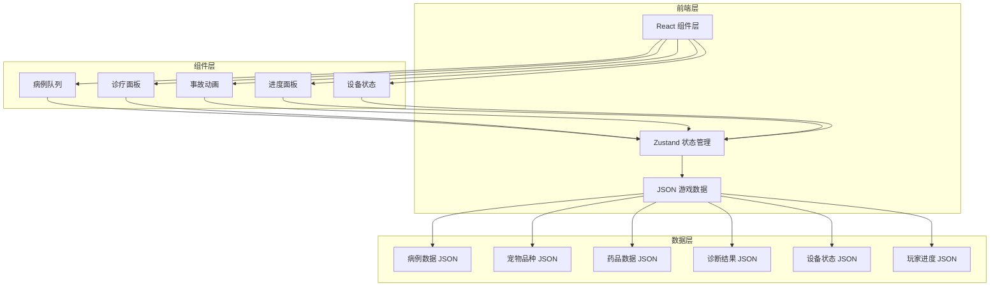
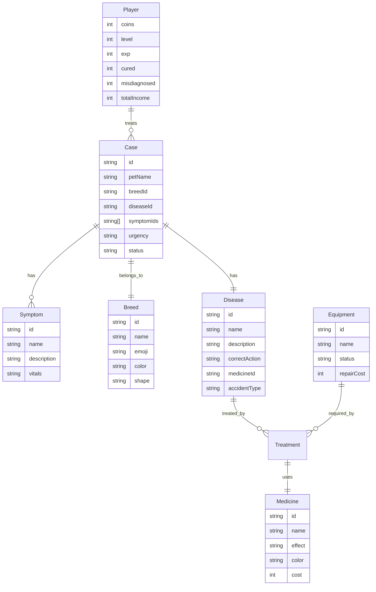

## 1. 架构设计



## 2. 技术说明

- **前端框架**: React@18 + TypeScript
- **样式方案**: Tailwind CSS@3 + 自定义CSS动画
- **构建工具**: Vite
- **状态管理**: Zustand@5
- **路由**: React Router DOM@7（单页应用，仅需一个主路由）
- **图标**: Lucide React
- **字体**: Google Fonts (Orbitron + Rajdhani)
- **数据存储**: 前端 JSON 数据 + localStorage 持久化
- **后端**: 无（纯前端游戏）

## 3. 路由定义

| 路由 | 用途 |
|------|------|
| / | 诊疗主页（唯一页面，包含所有游戏功能） |

## 4. 数据模型

### 4.1 数据模型定义



### 4.2 JSON 数据定义

```json
{
  "breeds": [
    { "id": "slime", "name": "黏液球", "emoji": "🟢", "color": "#00ff88", "shape": "blob" },
    { "id": "tentacle", "name": "触手怪", "emoji": "🟣", "color": "#7b61ff", "shape": "tentacles" },
    { "id": "crystal", "name": "晶晶体", "emoji": "🔷", "color": "#00d4ff", "shape": "prism" },
    { "id": "bubble", "name": "气泡兽", "emoji": "🟠", "color": "#ff8855", "shape": "bubbles" },
    { "id": "shadow", "name": "影子虫", "emoji": "⚫", "color": "#888899", "shape": "shadow" },
    { "id": "flame", "name": "火焰崽", "emoji": "🔴", "color": "#ff4422", "shape": "flame" }
  ],
  "diseases": [
    { "id": "split_pox", "name": "分裂痘", "description": "宠物身上出现分裂斑点", "correctAction": "inject", "medicineId": "stabilizer", "accidentType": "split" },
    { "id": "float_fever", "name": "飘浮热", "description": "宠物不受控制向上飘浮", "correctAction": "medicate", "medicineId": "gravity_pill", "accidentType": "float" },
    { "id": "chomp_bite", "name": "噬咬狂", "description": "宠物疯狂咬周围一切", "correctAction": "isolate", "medicineId": null, "accidentType": "bite" },
    { "id": "hunger_storm", "name": "饥饿风暴", "description": "宠物极度饥饿产生能量风暴", "correctAction": "feed", "medicineId": "cosmic_kibble", "accidentType": "float" },
    { "id": "crystal_cough", "name": "晶体咳", "description": "咳出小晶体碎片", "correctAction": "medicate", "medicineId": "soft_syrup", "accidentType": "split" },
    { "id": "shadow_rust", "name": "暗影锈", "description": "身体逐渐腐蚀生锈", "correctAction": "inject", "medicineId": "shine_serum", "accidentType": "bite" }
  ],
  "medicines": [
    { "id": "stabilizer", "name": "稳定剂", "effect": "阻止分裂", "color": "#00ff88", "cost": 30 },
    { "id": "gravity_pill", "name": "重力丸", "effect": "恢复引力", "color": "#7b61ff", "cost": 25 },
    { "id": "cosmic_kibble", "name": "宇宙粮", "effect": "满足饥饿", "color": "#ff8855", "cost": 15 },
    { "id": "soft_syrup", "name": "软化糖浆", "effect": "溶解晶体", "color": "#00d4ff", "cost": 35 },
    { "id": "shine_serum", "name": "闪光血清", "effect": "驱散暗影", "color": "#ffdd00", "cost": 40 }
  ],
  "symptoms": [
    { "id": "spotted_skin", "name": "斑点皮肤", "description": "皮肤上出现闪烁的分裂斑点", "vitals": "细胞分裂速率: 900%" },
    { "id": "rising_body", "name": "身体上升", "description": "宠物不受控制地向上飘浮", "vitals": "重力系数: -2.3" },
    { "id": "gnashing", "name": "磨牙撕咬", "description": "疯狂咬任何靠近的东西", "vitals": "咬合力: 5000N" },
    { "id": "empty_stomach", "name": "胃部空虚", "description": "能量场剧烈波动", "vitals": "饥饿指数: 99.7%" },
    { "id": "crystal_sputum", "name": "晶体痰", "description": "咳出小型晶体碎片", "vitals": "硬度: 莫氏8.5" },
    { "id": "rust_patches", "name": "锈斑", "description": "身体表面出现腐蚀锈斑", "vitals": "腐蚀速率: 3mm/h" }
  ],
  "equipment": [
    { "id": "scanner", "name": "扫描仪", "status": "normal", "repairCost": 50 },
    { "id": "injector", "name": "注射器", "status": "normal", "repairCost": 60 },
    { "id": "dispenser", "name": "药品发放器", "status": "normal", "repairCost": 45 },
    { "id": "feeder", "name": "喂食器", "status": "normal", "repairCost": 30 },
    { "id": "isolation_unit", "name": "隔离舱", "status": "normal", "repairCost": 80 }
  ]
}
```

## 5. Zustand Store 设计

```
useGameStore
├── cases: Case[]           — 当前病例队列
├── activeCaseId: string    — 当前选中病例ID
├── player: Player          — 玩家进度数据
├── equipment: Equipment[]  — 设备状态
├── gamePhase: 'idle' | 'diagnosing' | 'treating' | 'accident' | 'result'
├── accidentType: string    — 当前事故类型
├── diagnosisResult: object — 诊断结果
├── actions:
│   ├── selectCase(id)           — 选择病例
│   ├── performAction(action)    — 执行诊疗操作
│   ├── examine()                — 检查（获取更多信息）
│   ├── medicate(medicineId)     — 用药
│   ├── inject(medicineId)       — 打针
│   ├── feed()                   — 喂食
│   ├── isolate()                — 隔离
│   ├── repairEquipment(id)      — 维修设备
│   ├── generateNewCase()        — 生成新病例
│   ├── dismissAccident()        — 关闭事故动画
│   └── resetGame()              — 重置游戏
```

## 6. 组件架构

```
src/
├── App.tsx                    — 路由入口
├── index.css                  — 全局样式 + 动画
├── data/
│   └── gameData.ts            — 所有JSON游戏数据
├── store/
│   └── useGameStore.ts        — Zustand全局状态
├── components/
│   ├── CaseQueue.tsx          — 病例队列
│   ├── SymptomCard.tsx        — 症状卡展示
│   ├── TreatmentPanel.tsx     — 诊疗操作面板
│   ├── PetDisplay.tsx         — 宠物可视化展示
│   ├── AccidentOverlay.tsx    — 事故动画覆盖层
│   ├── EquipmentPanel.tsx     — 设备状态面板
│   ├── PlayerProgress.tsx     — 玩家进度面板
│   └── DiagnosisResult.tsx    — 诊断结果弹窗
├── pages/
│   └── Home.tsx               — 主页面（组装所有组件）
├── hooks/
│   └── useTheme.ts            — 主题切换
└── lib/
    └── utils.ts               — 工具函数
```
